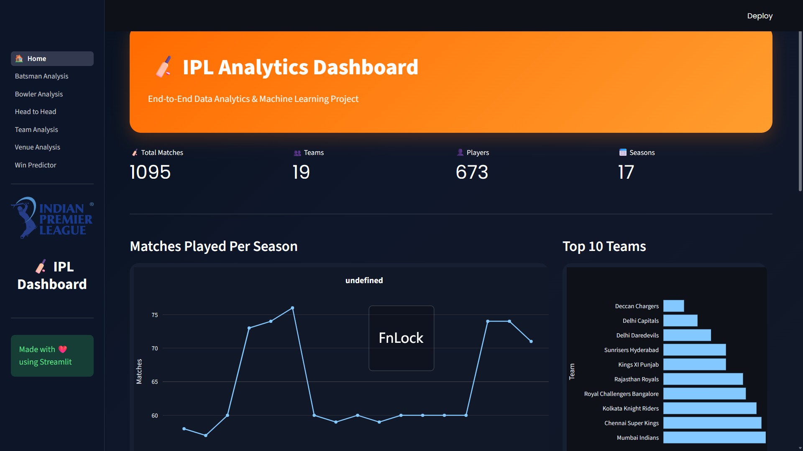
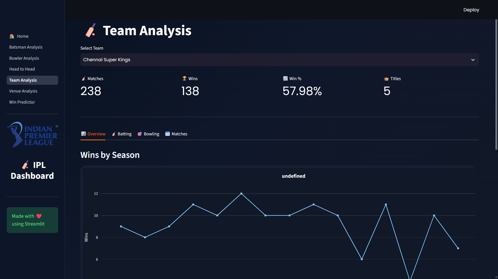
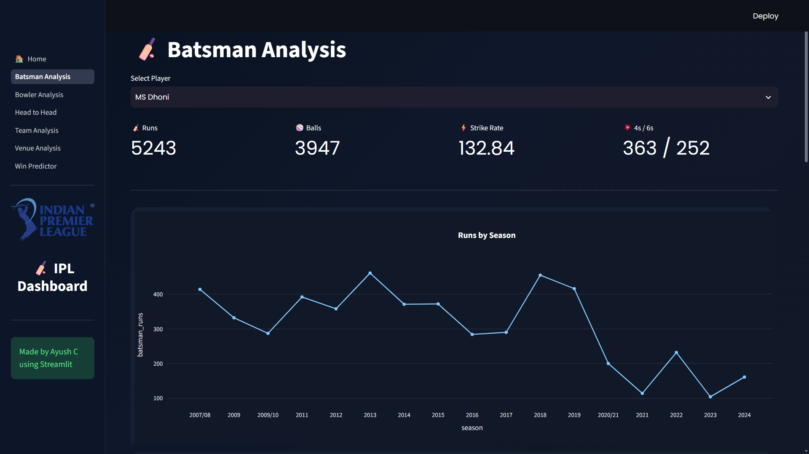
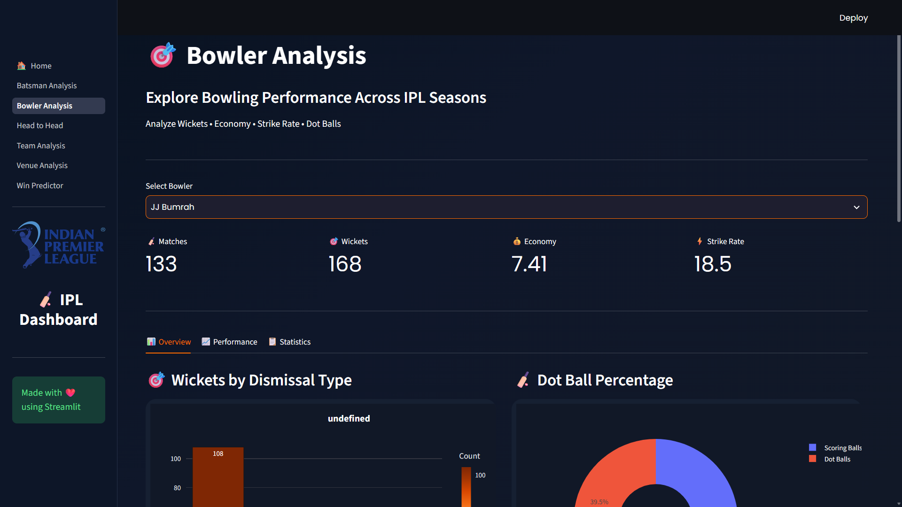
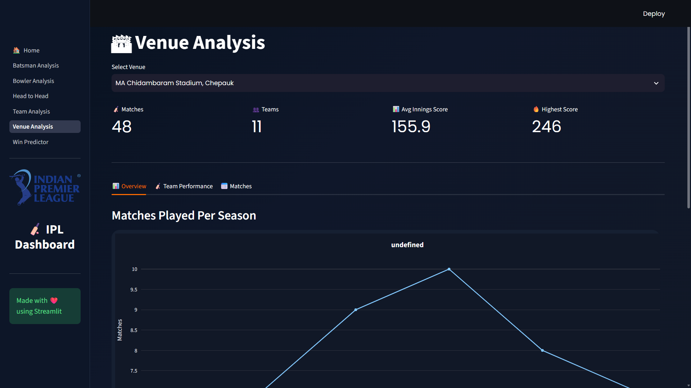
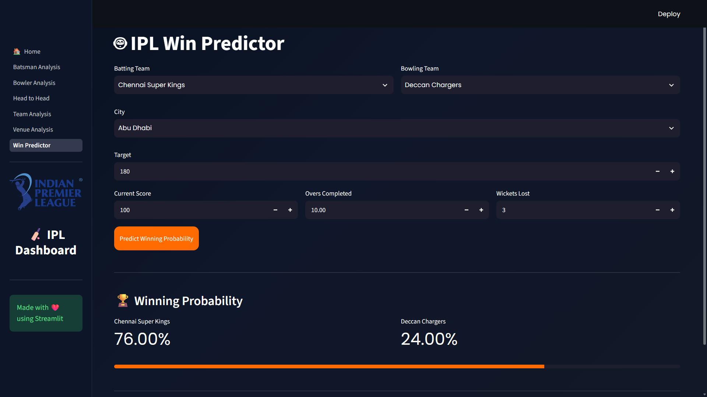

# 🏏 IPL Data Analytics Dashboard

An end-to-end **Data Analytics and Machine Learning** project built using **Python, Pandas, Plotly, Streamlit, and Scikit-Learn**.

This interactive dashboard provides comprehensive insights into IPL matches, teams, players, venues, bowling performances, head-to-head records, and predicts match-winning probabilities using Machine Learning.

---

## 🚀 Features

- 🏠 Interactive Home Dashboard
- 👥 Team Analysis
- 👤 Player Analysis
- 🎯 Bowler Analysis
- 🏟️ Venue Analysis
- ⚔️ Head-to-Head Comparison
- 🤖 IPL Win Predictor (Machine Learning)
- 📊 Interactive Plotly Visualizations
- ⚡ Fast Performance with Streamlit

---

## 🛠️ Tech Stack

- Python
- Pandas
- NumPy
- Matplotlib
- Plotly
- Streamlit
- Scikit-Learn
- Joblib

---

## 📂 Project Structure

```text
IPL_Data_Analytics_Dashboard/
│
├── assets/
├── data/
├── pages/
├── models/
├── app.py
├── requirements.txt
└── README.md
```

---

## 📊 Dashboard Modules

### 🏠 Home
Overview of IPL statistics and dashboard insights.

### 👥 Team Analysis
- Team-wise performance
- Win percentage
- Season-wise analysis

### 👤 Player Analysis
- Total Runs
- Strike Rate
- Boundaries
- Consistency

### 🎯 Bowler Analysis
- Wickets
- Economy Rate
- Bowling Performance

### 🏟️ Venue Analysis
- Matches Played
- Average Scores
- Winning Patterns

### ⚔️ Head-to-Head
Compare any two IPL teams across all IPL seasons.

### 🤖 Win Predictor
Predict match-winning probability using Machine Learning.

---

## 📈 Dataset

- matches.csv
- deliveries.csv

---
## 📸 Dashboard Preview

### 🏠 Home


### 👥 Team Analysis


### 🏏 Batsman Analysis


### 🎯 Bowler Analysis


### 🏟 Venue Analysis


### ⚔️ Head-to-Head Analysis


### 🤖 Win Predictor


---

## ▶️ How to Run

Clone the repository

```bash
git clone https://github.com/ayushc2426-ai/IPL-Data-Analytics-Dashboard.git
```

Install dependencies

```bash
pip install -r requirements.txt
```

Run the application

```bash
streamlit run 🏠_Home.py
```

---

## 👨‍💻 Author

**Ayush Chambhare**

B.Tech – Artificial Intelligence & Data Science

GitHub: https://github.com/ayushc2426-ai

---

⭐ If you found this project useful, consider giving it a star!